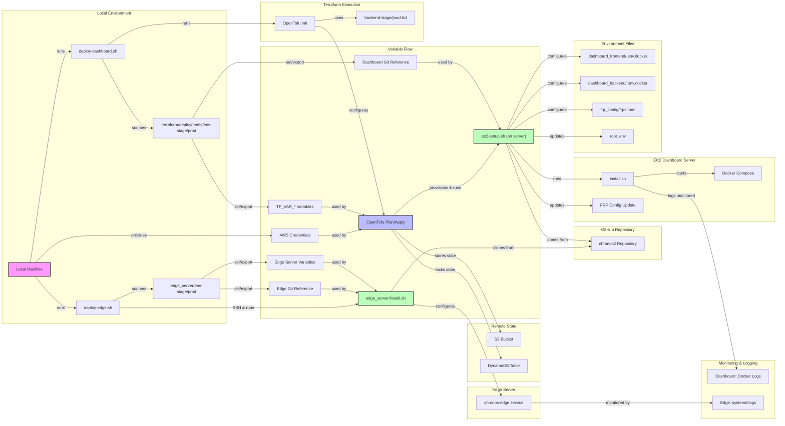

# Infrastructure and Deployment Guide

## Architecture Overview

The deployment architecture uses a combination of local deployment scripts and EC2 instance setup scripts. Here's how the components interact:



## Prerequisites

- [OpenTofu](https://opentofu.org/) version >=1.8.0
- AWS CLI configured with appropriate credentials
- SSH key pair for EC2 access

## IAM Setup

Before creating any resources, set up the appropriate IAM permissions:

1. Create an IAM policy:
```bash
# Save the policy from terraform/modules/policies/terraform-deployment-policy.json
aws iam create-policy \
    --policy-name agt-chronos-terraform-deployment \
    --policy-document file://terraform/modules/policies/terraform-deployment-policy.json
```

The policy provides:
- Full access to AGT-specific state resources (S3 bucket and DynamoDB table)
- EC2 permissions for creating and managing infrastructure:
  - VPC and networking components (subnets, internet gateways, route tables)
  - Security groups and network ACLs
  - Elastic IPs
  - EC2 instances and related resources
- IAM permissions for AGT-prefixed roles and policies
- ECR permissions for AGT-prefixed repositories

2. Attach the policy to your IAM user:
```bash
aws iam attach-user-policy \
    --user-name YOUR_USERNAME \
    --policy-arn arn:aws:iam::436957243186:policy/agt-chronos-terraform-deployment
```

3. Configure AWS CLI profile:
```bash
aws configure --profile agt
# Enter your access key and secret
# Set the default region to us-east-1
export AWS_PROFILE=agt  # This profile name will be used to prefix resource names
```

## Deployment Process

### 1. State Management Setup

> **_Note:_** This step should be run manually once for the lifetime of the deployment.

The state management setup follows a bootstrapping process:

1. **Initial State Creation (Bootstrap)**
   - Uses a local backend initially (no remote state required)
   - Creates the S3 bucket and DynamoDB table for future state management
   - This is a one-time setup per AWS account/profile

```bash
cd terraform/state
tofu init
tofu plan -var="bucket_name=${AWS_PROFILE}-chronos-terraform-state-storage" \
         -var="table_name=${AWS_PROFILE}-chronos-terraform-state-locks"
tofu apply -var="bucket_name=${AWS_PROFILE}-chronos-terraform-state-storage" \
          -var="table_name=${AWS_PROFILE}-chronos-terraform-state-locks"
```

This creates:
- S3 bucket: `${AWS_PROFILE}-chronos-terraform-state-storage`
- DynamoDB table: `${AWS_PROFILE}-chronos-terraform-state-locks`

2. **Remote State Transition**
   - After bootstrap, all subsequent deployments use these resources
   - State is stored in: `${AWS_PROFILE}-chronos-terraform-state-storage`
   - Locks managed in: `${AWS_PROFILE}-chronos-terraform-state-locks`
   - Backend configs (e.g., `backend-stage-agt.hcl`) point to these resources

Note: State resources are protected against accidental destruction. Manual intervention in AWS Console is required for removal.

### 2. Deploy Shared Resources

After state resources are created, deploy shared resources:

```bash
cd terraform/shared
tofu init -backend-config="../deployments/backend-stage-${AWS_PROFILE}.hcl"
tofu plan    # Review the changes
tofu apply   # Apply the changes
```

This creates:
- VPC with IPv6 support
- Public subnet with auto-assign public IP
- Internet Gateway with IPv4 and IPv6 routes
- Security Group allowing all traffic (customize as needed)
- Network ACL with basic allow rules
- Elastic IPs for staging and production environments
- IAM roles and policies for EC2 instances

### 3. Dashboard Deployment

1. Configure environment:
```bash
# Copy the template for your environment (stage or prod)
cp terraform/deployments/env.template terraform/deployments/env-stage  # or env-prod

# Edit the environment file with your values:
# Required variables:
# - TF_VAR_deptype: Must match environment (stage or prod)
# - TF_VAR_public_key: Your SSH public key
# - TF_VAR_additional_public_key: Additional SSH key if needed
# - TF_VAR_vite_api_base_url: API URL (e.g., https://your-domain.com/api)
# - TF_VAR_postgres_password: Database password
# - TF_VAR_jwt_secret_key: JWT secret for authentication
# - TF_VAR_edge_server_ip: Edge server IP address
# - TF_VAR_edge_server_port: Edge server port
# - TF_VAR_user_1_email: Admin user email
# - TF_VAR_user_1_password: Admin user password
# - GIT_REF: Git reference to deploy (e.g., main)
```

2. Deploy:
```bash
cd terraform
./deploy-dashboard.sh stage  # or prod
```

The script supports three actions:
- plan: Preview changes (default)
- apply: Apply changes
- destroy: Destroy resources

Example:
```bash
./deploy-dashboard.sh stage plan   # Preview changes
./deploy-dashboard.sh stage apply  # Apply changes
```

## Implementation Details

### Variable Flow

1. **Local Environment Variables**
   - Variables are set in `deployments/env-stage` or `deployments/env-prod` files
   - Format: `TF_VAR_variable_name="value"`
   - These variables are used by both OpenTofu and the deployment scripts

2. **OpenTofu to EC2**
   - Variables are passed to the EC2 instance via user data script
   - The `ec2-setup.sh` script receives these variables as shell variables
   - Used for initial instance configuration and application setup

3. **Application Configuration**
   - Environment variables are injected into various `.env` files:
     - `dashboard_frontend/.env.docker`
     - `dashboard_backend/.env.docker`
     - `edge_server/.env.docker`
     - `frp_config/frps.toml`
     - `.env` (root level)

### EC2 Instance Setup

The `ec2-setup.sh` script performs:
1. Installs Docker and required packages
2. Adds the configured public SSH keys for the ubuntu user
3. Clones the repository and initializes submodules
4. Creates and updates environment files
5. Configures FRP
6. Runs the installation script

### Domain Configuration

The domain name is managed through environment variables:
- Base URL is extracted from `TF_VAR_vite_api_base_url`
- Used in frontend configuration and deployment URI
- Docker Compose uses `DEPLOYMENT_URI` from environment

## Notes

- Environment files (env-*) are gitignored to prevent committing sensitive information
- Each environment (stage/prod) maintains its own state in the configured S3 bucket
- The deployment scripts validate all required variables before proceeding
- State resources are protected against accidental destruction (manual intervention in AWS Console required for removal)

## Monitoring

To view logs:
- Dashboard: Connect to the EC2 instance and check docker logs
- Edge Server: `journalctl -u chronos-edge -f`
